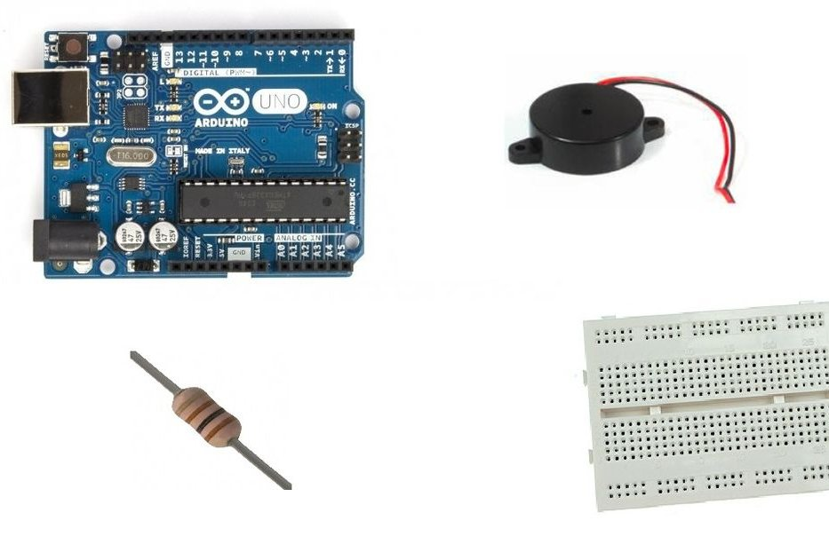
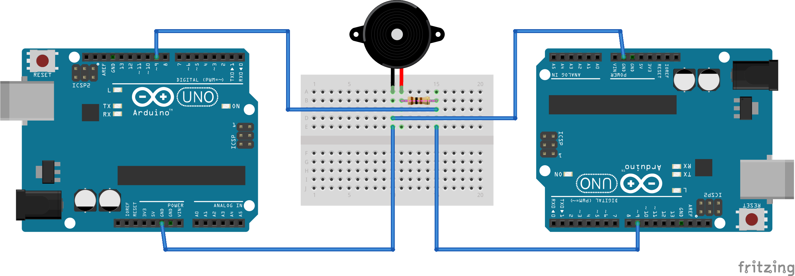

# Morse
A morse transmitter and receiver all written in Scratch (mBlock).
## Step 1: What You Will Need
To build this project we need two Arduino UNO and, optionally a 100 Ω resistor, an active piezoelectric buzzer (a buzzer that beeps only powering it) and a breadboard.

## Step 2: The Circuit

## Step 3: The Code
